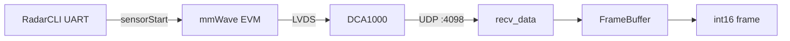

# Standalone mmWave capture

Minimal Python capture for **TI mmWave + DCA1000**, extracted from `multimodal-ros/sensors` without ROS.

## What came from where

| Original (ROS repo) | Role |
|---------------------|------|
| `radar_pub.py` | Orchestrates DCA + UART + frame assembly |
| `dca1000.py` | UDP command socket + UDP data socket |
| `frame_buffer.py` | Reassembles UDP packets into one ADC frame |
| `radar_config.py` | Parses `.cfg` → `frame_size`, chirps, RX/TX |
| `radar_cli.py` | UART: upload cfg, `sensorStart` / `sensorStop` |

`radar_capture_utils.py` is an older, larger variant of the same DCA1000 logic (OpenRadar-style). The ROS stack uses the slimmer `dca1000.py` instead.

## Data flow



Each UDP packet: 4-byte seq, 6-byte byte count, then ADC payload (~1456 bytes).

## Setup

```bash
cd standalone_mmwave
python3 -m venv .venv && source .venv/bin/activate
pip install -r requirements.txt
```

Host network (typical DCA setup):

- PC: `192.168.33.30`
- DCA: `192.168.33.180`
- Data UDP port: `4098`, command port: `4096`

Set your Mac/Linux Ethernet adapter to that subnet (e.g. `192.168.33.30`, mask `255.255.255.0`). The DCA does **not** use udev; it uses **UDP over Ethernet**.

### USB udev rules (Linux only — radar UART, not DCA)

`install_udev_rules.sh` gives your user permission to open `/dev/ttyUSB*` and `/dev/ttyACM*` for the **mmWave EVM** (cfg upload, `sensorStart`). It does **not** affect DCA UDP.

On **Linux** (once):

```bash
./install_udev_rules.sh
# unplug/replug USB, or log out and back in
ls /dev/ttyUSB* /dev/ttyACM* 2>/dev/null
```

### macOS

- **No udev** — ignore `install_udev_rules.sh`.
- Always use **`python3`** (not bare `python` if that points at conda without pyserial):
  ```bash
  python3 -m pip install -r requirements.txt
  ```
- **DCA (Ethernet):** System Settings → Network → adapter plugged into the DCA (often USB‑Ethernet):
  - Configure IPv4 **Manually**
  - IP: `192.168.33.30`
  - Subnet: `255.255.255.0`
  - Router: leave blank
  - Test: `ping 192.168.33.180`
- Start the radar stream in **mmWave Studio** (or sensor already running), then:
  ```bash
  CFG=../multimodal-ros/xwr_raw_ros/configs/6843isk/xwr68xx_3Tx_wfv0.5_RDAhigh_19.2m.cfg
  python3 radar_receiver.py --cfg "$CFG" --dca-only --frames 10
  ```
- **USB serial (optional):** `ls /dev/cu.usb*` then `--cmd-tty /dev/cu.usbserial-XXXX` (not `/dev/ttyUSB0`).
- If configure times out: wrong network interface (Wi‑Fi vs DCA Ethernet), DCA off, or Mac firewall blocking UDP.

## Record raw captures (for offline algorithms)

Store **raw int16 ADC frames** so you can rerun cube / RDA / tracking / Max later:

```bash
python3 capture_radar.py --name my_experiment --frames 500 \
  --cmd-tty /dev/cu.usbserial-00D832110
```

Creates `captures/YYYYMMDD_HHMMSS_my_experiment/`:

| File | Purpose |
|------|---------|
| `raw/frame_*.npy` | Raw ADC (reprocess anytime) |
| `profile.cfg` | Exact mmWave profile used |
| `metadata.json` | `radar_params` (range_res, n_chirps, …) |
| `session.json` | Manifest + data layout |
| `index.csv` | Frame index + timestamps |

Reprocess later:

```bash
python3 -m processing.process_capture --capture captures/YYYYMMDD_HHMMSS_my_experiment
```

Load in Python:

```python
from capture_store import CaptureSession
session = CaptureSession.open("captures/YYYYMMDD_HHMMSS_my_experiment")
for i, raw in session.iter_frames():
    cube = ...  # processing.frame_to_radar_cube(raw, session.radar_params())
```

Do **not** store only range/Doppler/angle — always keep **raw**; derived maps can be recomputed.

## Signal processing roadmap (FFTs, raw → metrics)

First time reading the processing code:

**[docs/PROCESSING_ROADMAP.md](docs/PROCESSING_ROADMAP.md)**

Covers: where range / Doppler / azimuth FFTs live (`processing/rda.py`, `angle_estimate.py`), how `frame_*.npy` becomes range / velocity / angle / gesture, and a file-by-file map.

## Push / pull gesture (live, replay, analysis)

Workflow, global-mean clutter, push/pull peak rule, and commands:

**[docs/push_pull.md](docs/push_pull.md)**

## Live stream → Max (OSC)

```bash
python3 live_radar_to_max.py
python3 replay_capture_to_max.py --capture push_pull
```

Settings: `config/live_radar_to_max.json`. Max: `[udpreceive 9000]` → `[OSC-route /radar]`.

## Run (live stream)

Copy a `.cfg` from the old repo, e.g.:

```bash
CFG=../multimodal-ros/xwr_raw_ros/configs/6843isk/xwr68xx_3Tx_wfv0.5_RDAhigh_19.2m.cfg

python radar_receiver.py --cfg "$CFG" --cmd-tty /dev/ttyUSB0 --frames 10
```

DCA only (radar already running in mmWave Studio):

```bash
python radar_receiver.py --cfg "$CFG" --dca-only --frames 10
```

Save frames:

```bash
python radar_receiver.py --cfg "$CFG" --save ./captures --frames 100
```

## Reshape a frame

After capture, `frame_data` is flat `int16`. Reshape using params from the cfg:

```python
p = RadarConfig(open("profile.cfg").readlines()).get_params()
# complex 1x: (n_chirps, n_rx, n_samples) with I/Q in sample dimension
```
