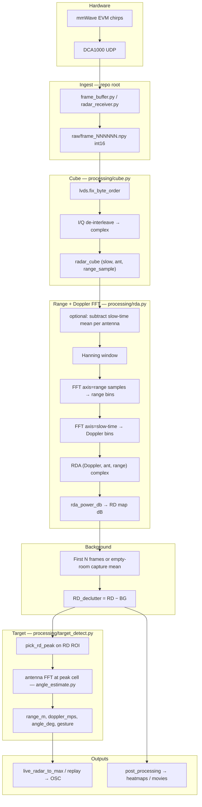

# Signal processing roadmap

Concise guide for reading this repo the first time: **where FFTs happen**, how **raw ADC** becomes **range / velocity / angle / gesture**, and which files to open.

---

## End-to-end path (one frame)



**Waveform** here means the **complex sample matrix** along fast time (ADC samples per chirp), not a plotted sine wave. Each chirp is a burst of IQ samples; slow-time stacks chirps across the frame.

---

## Where the FFTs are

| Step | What | File | Function | FFT axis |
|------|------|------|----------|----------|
| 1 | **Range** (distance) | `processing/rda.py` | `compute_rda()` | `axis=-1` on `n_samples` (fast time / ADC) |
| 2 | **Doppler** (velocity) | `processing/rda.py` | `compute_rda()` | `axis=0` on slow-time, then `fftshift` |
| 3 | **Azimuth** (angle) | `processing/angle_estimate.py` | `angle_spectrum_fft()`, `angle_deg_at_rd_cell()` | FFT across **virtual antennas** at one RD cell |

There is **no separate “waveform FFT” file** — the chirp samples *are* the time-domain waveform; the range FFT transforms fast time → range bins.

Optional third use of FFT (offline only):

| Step | What | File |
|------|------|------|
| Range–azimuth maps / movies | Per-range Doppler pick → antenna FFT | `processing/range_azimuth.py` |

---

## Stage-by-stage (what each value means)

### 1. Raw frame (`int16`)

- **Source:** DCA UDP → `radar_receiver.py` / `capture_radar.py` → `captures/.../raw/frame_*.npy`
- **Shape:** flat `int16` (LVDS packet layout from the `.cfg`)
- **Do not** delete raw captures; everything downstream can be recomputed.

### 2. Radar cube (complex, no FFT yet)

- **Code:** `processing/cube.py` → `frame_to_radar_cube(frame, radar_params)`
- **Steps:** byte order fix (`lvds.py`) → interleaved I/Q → complex → reshape to `(n_slow, n_virtual_antennas, n_samples)`
- **Axes:** slow-time × antennas × **fast-time samples** (pre-FFT)

`radar_params` (range resolution, chirp count, etc.) comes from `metadata.json` / `RadarConfig` parsing the same `.cfg` used at capture.

### 3. Range–Doppler (first two FFTs)

- **Code:** `processing/rda.py` → `compute_rda(cube)` then `rda_power_db(rda)`
- **Inside `compute_rda`:**
  1. Optional **clutter:** subtract mean over slow-time per antenna (zero-Doppler suppression on that frame).
  2. Hanning window on range and Doppler dimensions.
  3. **Range FFT** along sample axis.
  4. **Doppler FFT** along slow-time, shifted so 0 m/s is centered.
- **Output RD map:** `(n_doppler_bins, n_range_bins)` in **dB**, antennas averaged in `rda_power_db`.

### 4. Background subtraction (not an FFT)

- **Live / replay:** `LiveRadarTargetProcessor` averages RD maps over the first `calibration_frames` (or uses `background.capture`) → subtracts from every frame.
- **Offline plots:** `background_model.py` + `post_processing/plot_heatmap.py` (same idea).

### 5. Peak + metrics (live / replay / some plots)

- **Code:** `processing/target_detect.py`
- **Peak:** `pick_rd_peak()` on decluttered RD — argmax SNR, or nearest-range among high-SNR cells when push/pull is on.
- **SNR:** cell power − median(RD ROI).
- **Range / Doppler:** bin centers from `range_doppler_axes()` at the chosen cell.
- **Angle:** snapshot `rda[d, :, r]` → antenna FFT → argmax bin (`angle_estimate.py`).
- **Push/pull gesture:** with `push_pull.enabled` + `use_range_derivative_for_doppler`, `doppler_mps = d(range)/dt`; gesture `push` / `pull` / `none` from sign of that velocity (`classify_gesture_from_velocity`).

### 6. OSC to Max

- **Code:** `live_radar_to_max.py`, `replay_capture_to_max.py`
- **OSC packing:** `processing/osc_utils.py` → `build_osc_message()`
- **Config:** `config/live_radar_to_max.json` (addresses, ROI, push/pull, gesture thresholds)

---

## Two pipelines (same math, different wrappers)

| Path | Entry | Uses |
|------|--------|------|
| **Live / replay** | `live_radar_to_max.py`, `replay_capture_to_max.py` | `target_detect.LiveRadarTargetProcessor.update(frame)` per frame |
| **Offline batch** | `processing/process_capture.py` | All frames → `processed.npz` |
| **Analysis plots** | `post_processing/plot_heatmap.py`, `plot_rd_movie.py`, `plot_range_azimuth_movie.py` | Same `cube` / `rda` / `background_model`; some plots use legacy range–time FFT order in `rd_maps.py` — see `post_processing/HOW_METRICS_WORKED.md` |

---

## File map (first time in the repo)

| If you want to understand… | Open |
|----------------------------|------|
| UDP → raw bytes | `radar_receiver.py`, `frame_buffer.py`, `dca1000.py` |
| `.cfg` → `radar_params` | `radar_config.py` |
| Saved captures API | `capture_store.py` |
| int16 → complex cube | `processing/cube.py`, `processing/lvds.py` |
| **Range + Doppler FFT** | **`processing/rda.py`** |
| **Azimuth FFT** | **`processing/angle_estimate.py`** |
| Live target + gesture | `processing/target_detect.py` |
| Range–azimuth heatmaps | `processing/range_azimuth.py`, `post_processing/plot_heatmap.py` |
| Background mean | `background_model.py` |
| Push/pull behavior & OSC | `docs/push_pull.md`, `config/live_radar_to_max.json` |
| Capture + network setup | `README.md` (repo root) |

---

## Typical numbers (default 6843 3Tx profile)

From `metadata.json` after capture (approximate):

| Quantity | Typical |
|----------|---------|
| Slow-time bins | 32 (96 chirps ÷ 3 TX) |
| Virtual antennas | 12 |
| Range samples (pre-FFT) | 256 |
| RD size | 32 × 256 (Doppler × range) |
| Angle FFT bins (config) | 128 (`angle_estimation.fft_bins`) |

---

## Quick experiments

```bash
# One capture → RD stack in processed.npz
python3 -m processing.process_capture --capture captures/push_pull --plot

# Replay same processing as live → Max
python3 replay_capture_to_max.py --capture push_pull

# Static heatmaps (range–time, azimuth–time, range–azimuth)
python3 -m post_processing.plot_heatmap --capture push_pull
```

---

## Related docs

- [push_pull.md](push_pull.md) — gesture, nearest-range peak, range derivative on `/radar/doppler_mps`
- [../post_processing/README.md](../post_processing/README.md) — analysis scripts
- [../processing/README.md](../processing/README.md) — short module index (points here)
