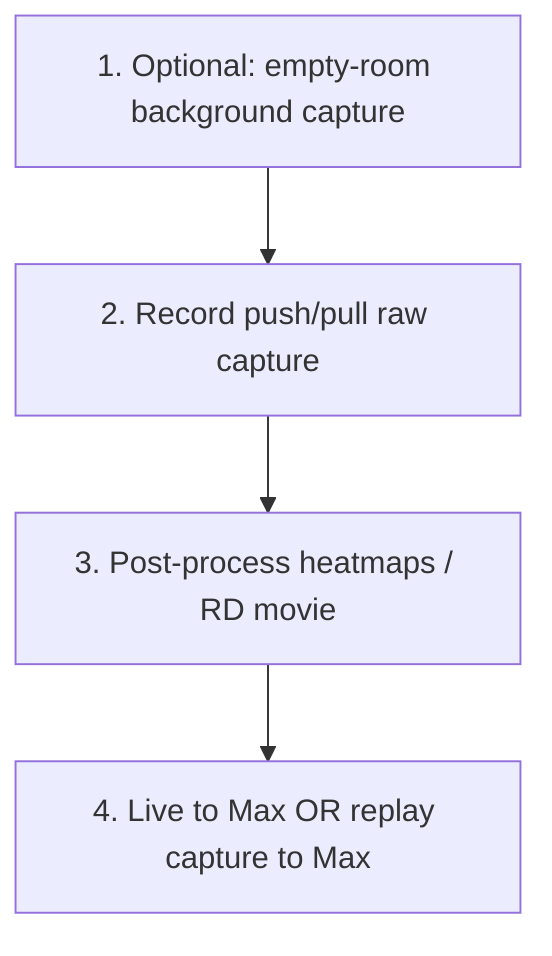

# Push / pull gesture — workflow & processing

Concise reference for how we capture, process, and stream the **push/pull** gesture today. All paths assume:

```bash
cd standalone_mmwave
source .venv/bin/activate   # if you use a venv
```

Central settings: [`config/live_radar_to_max.json`](../config/live_radar_to_max.json).

---

## Workflow (end to end)



| Step | What | Output |
|------|------|--------|
| **1. Background (recommended)** | Stand still in empty room ~1 s+ | `captures/..._empty_room/` |
| **2. Capture gesture** | Perform push/pull while recording | `captures/..._push_pull/raw/frame_*.npy` |
| **3. Analyze offline** | SNR heatmaps, range–Doppler, movies | `captures/.../analysis/*.png`, `rd_heatmap_movie.mp4` |
| **4. Max / OSC** | Live radar or replay through same processor | UDP OSC → Max on port 9000 |

---

## Global-mean clutter (how background is removed)

Used in **live**, **replay**, and **post-processing** (same idea, slightly different wiring).

### Per frame (inside range–Doppler FFT)

Each raw frame is turned into a cube, then `compute_rda()` subtracts the **slow-time mean per antenna** (zero-Doppler / static clutter on that frame) before range and Doppler FFTs.

### Session background (global mean in dB)

After calibration, every frame’s range–Doppler **power (dB)** has a fixed background subtracted:

- **Live / replay (`LiveRadarTargetProcessor`):** average RD map over the first `calibration_frames` (default **45**), *or* mean of an **empty-room capture** if `background.capture` is set in config.
- **Post-processing (`plot_heatmap`, `plot_rd_movie`):** same — first N frames of the clip, or dedicated background capture.

During the first `calibration_frames` live, **no OSC target is sent** (processor returns `None`). Stay out of the beam or hold a still pose you want subtracted.

### SNR for peak picking

On the decluttered ROI map:

`SNR(dB) = cell_power − median(ROI)`

Default mode: **argmax SNR** (strongest blob).  
Push/pull mode: see below.

---

## Push/pull peak rule (temporary)

**Problem:** torso is stationary and often has higher SNR than moving arms; global max tracks the body, not the gesture.

**Rule (config `push_pull.enabled`):** among all RD cells whose SNR is within `snr_within_db_of_max` of the global max, pick the **closest range** (favors arms reaching toward the radar).

| Config key | Typical value | Meaning |
|------------|---------------|---------|
| `push_pull.enabled` | `true` for gesture, `false` otherwise | Toggle |
| `push_pull.snr_within_db_of_max` | `3`–`5` | How close in dB a candidate must be to the max SNR |

Implementation: `processing/target_detect.py` → `pick_rd_peak()`.

CLI overrides: `--push-pull` / `--no-push-pull`, `--push-pull-snr-within-db 4`.

---

## Config checklist (push/pull)

Edit `config/live_radar_to_max.json`:

```json
"processing": {
  "roi_min_m": 0.0,
  "roi_max_m": 3.0,
  "presence_threshold_db": 0.0,
  "calibration_frames": 45,
  "frame_average_count": 10,
  "smooth_alpha": 0.2
},
"push_pull": {
  "enabled": true,
  "snr_within_db_of_max": 4.0
},
"background": {
  "capture": "captures/your_empty_room",
  "max_frames": 0
}
```

| Field | Notes |
|-------|--------|
| `roi_max_m` | Limit range to gesture zone (e.g. 0–3 m) |
| `frame_average_count` | Sliding mean over raw frames before RD (reduces speckle) |
| `background.capture` | **Strongly recommended** — don’t use first 45 frames of push/pull as background |
| `presence_threshold_db` | OSC gated when SNR below this (0 = always send if peak exists) |

Device/network: set `device.cmd_tty`, `network.dca_ip`, `network.osc_host` / `osc_port` for your machine.

---

## Commands

### 1. Empty-room background (once per room layout)

```bash
python3 capture_radar.py --name empty_room --duration-sec 10 \
  --cmd-tty /dev/cu.usbserial-00D832110
```

Point `background.capture` at that folder (path or bare name under `captures/`).

### 2. Record push/pull

```bash
python3 capture_radar.py --name push_pull --duration-sec 15 \
  --cmd-tty /dev/cu.usbserial-00D832110
```

Or rely on live capture (`capture.enabled: true` in config) while running step 3.

### 3. Post-processing (heatmaps + diagnostics)

Uses same config for ROI, calibration, background, SNR threshold:

```bash
python3 -m post_processing.plot_heatmap --capture push_pull
```

Writes under `captures/push_pull/analysis/`:

- `range_time_snr.png` — SNR vs range & time (max over Doppler per frame)
- `range_doppler_mean.png`, `range_doppler_peak.png`
- `doppler_time_snr.png`, `range_azimuth_fft.png`, …
- `range_gate.json` — estimated range gate for that capture

Range–Doppler **movie** (per-frame RD; can look noisy — prefer `--power-db` or empty-room BG):

```bash
python3 -m post_processing.plot_rd_movie --capture push_pull
python3 -m post_processing.plot_rd_movie --capture push_pull --power-db
```

### 4a. Live → Max (OSC)

Max: `[udpreceive 9000]` → `[OSC-route /radar]`.

```bash
python3 live_radar_to_max.py
```

With explicit flags:

```bash
python3 live_radar_to_max.py --push-pull --push-pull-snr-within-db 4 \
  --background-capture captures/empty_room
```

OSC addresses (defaults): `/radar/range_m`, `/radar/doppler_mps`, `/radar/angle_deg`, `/radar/snr_db`, `/radar/presence`, `/radar/mode`.

### 4b. Replay capture → Max (same processing as live)

```bash
python3 replay_capture_to_max.py --capture push_pull
python3 replay_capture_to_max.py --capture push_pull --speed 1.0 --loop
```

---

## What we have encoded so far

| Piece | Status |
|-------|--------|
| Raw capture + metadata | `capture_radar.py`, `captures/*/raw/` |
| Global-mean RD background | First N frames or `background.capture` |
| Range ROI + frame averaging | `config/live_radar_to_max.json` |
| Push/pull nearest-range peak | `push_pull.enabled` + `pick_rd_peak()` |
| Live + replay OSC to Max | `live_radar_to_max.py`, `replay_capture_to_max.py` |
| Offline SNR / RD / azimuth plots | `post_processing.plot_heatmap` |
| RD heatmap movie | `post_processing.plot_rd_movie` |

**Not yet a proper multi-target tracker** — push/pull is a heuristic until a better algorithm replaces it.

---

## Troubleshooting

| Symptom | Likely cause | Try |
|---------|----------------|-----|
| Tracks torso, not arms | `push_pull.enabled` false | Set `enabled: true` or `--push-pull` |
| Arms still ignored | Arm SNR &lt; `snr_within_db_of_max` below torso | Increase to 5–6 dB |
| Weak / flickery stream | No empty-room BG; gesture in calib window | `background.capture` + stand clear for first 45 frames |
| RD movie looks bad | Per-frame median “SNR”, BG from same clip | `--power-db`, empty-room background |
| No OSC during startup | Calibrating | Wait `calibration_frames` / use fixed background capture |

---

## Related docs

- [Main README](../README.md) — hardware setup, DCA network, raw capture format  
- [config/README.md](../config/README.md) — range gate auto-estimation for heatmaps  
- [post_processing/README.md](../post_processing/README.md) — plot module details  
